# 🎵 Muzyczka

**Muzyczka** to aplikacja desktopowa do odtwarzania muzyki, napisana w technologii **WPF / C#**. Program umożliwia przeglądanie lokalnej biblioteki muzycznej, tworzenie kolejki odtwarzania oraz odtwarzanie plików audio zapisanych na komputerze użytkownika.

Projekt skupia się na nowoczesnym, przejrzystym interfejsie oraz wygodnym zarządzaniu muzyką lokalną.

---

## 📌 Opis projektu

Aplikacja pozwala użytkownikowi wygodnie zarządzać lokalnymi plikami muzycznymi. Utwory są pobierane z folderu `Library`, a następnie wyświetlane w panelu biblioteki. Użytkownik może zaznaczać pojedyncze pliki, wiele plików lub całe foldery, a następnie przeciągać je do kolejki odtwarzania.

Program odczytuje metadane plików audio, takie jak:

- tytuł utworu,
- wykonawca,
- album,
- rok wydania,
- numer ścieżki,
- gatunek muzyczny,
- okładka albumu.

---

## ✨ Główne możliwości aplikacji

- Przeglądanie lokalnej biblioteki muzycznej z folderu `Library`.
- Wyświetlanie folderów, podfolderów i plików audio w panelu biblioteki.
- Zaznaczanie wielu plików i folderów przez `Ctrl` oraz `Shift`.
- Dodawanie utworów i folderów do kolejki metodą **przeciągnij i upuść**.
- Grupowanie kolejki odtwarzania według folderów.
- Sortowanie kolejki po kolumnach: numer, nazwa, album, wykonawca i rok.
- Usuwanie zaznaczonych utworów z kolejki przyciskiem **Usuń** lub klawiszem `Delete`.
- Odczytywanie metadanych plików audio.
- Wyświetlanie okładek albumów.
- Filtrowanie biblioteki według kategorii / gatunków muzycznych.
- Wyszukiwanie utworów i folderów z podświetlaniem pasującego fragmentu tekstu.
- Odtwarzanie, pauzowanie, przechodzenie do poprzedniego i następnego utworu.
- Regulacja poziomu głośności.

---

## 📊 Diagram przypadków użycia

W dokumentacji projektu można dodać diagram przedstawiający główne interakcje użytkownika z aplikacją.

Przykładowe przypadki użycia:

- przeglądanie biblioteki muzycznej,
- wyszukiwanie utworów,
- filtrowanie po kategoriach / gatunkach,
- dodawanie utworów i folderów do kolejki,
- zarządzanie kolejką odtwarzania,
- odtwarzanie muzyki,
- sterowanie głośnością,
- wyświetlanie metadanych i okładek albumów.

---

## 👥 Autorzy

- Illia Bryka
- Bohdan Oliinyk

---

# 📸 Screeny z działania aplikacji

## 🏠 Główny widok aplikacji

Widok główny składa się z trzech części: panelu biblioteki po lewej stronie, kolejki odtwarzania w środkowej części oraz odtwarzacza muzycznego po prawej stronie.

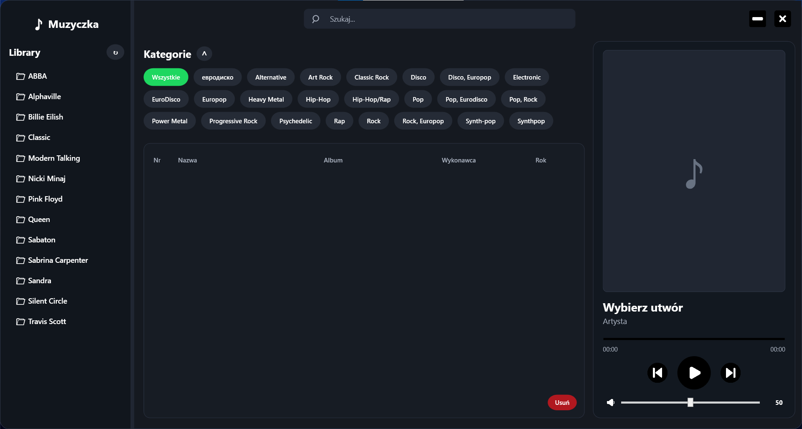

---

## 📁 Biblioteka muzyczna

Panel biblioteki pozwala przeglądać foldery oraz pliki audio znajdujące się w katalogu `Library`. Użytkownik może zaznaczać pojedyncze elementy, wiele elementów lub całe foldery.

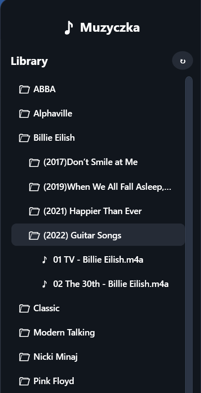

---

## 🔍 Wyszukiwarka

Aplikacja posiada pasek wyszukiwania, który pozwala szybko odnaleźć utwory, foldery lub albumy. Pasujące fragmenty tekstu są wyróżniane zielonym kolorem.

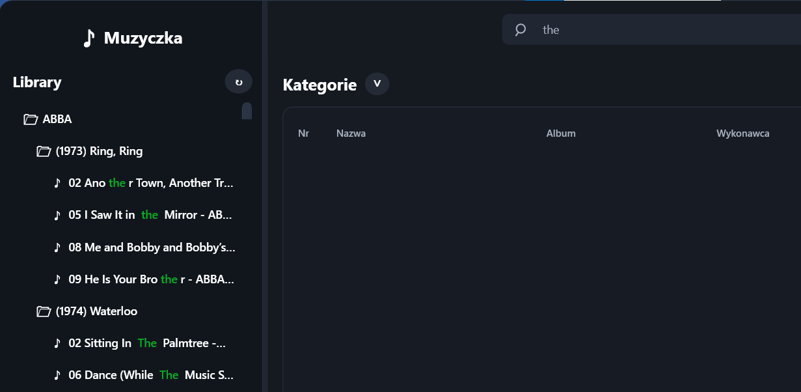

---

## 🏷 Kategorie / Gatunki muzyczne

Kategorie są generowane automatycznie na podstawie metadanych plików muzycznych. Po wybraniu konkretnego gatunku w bibliotece wyświetlane są tylko pasujące utwory.

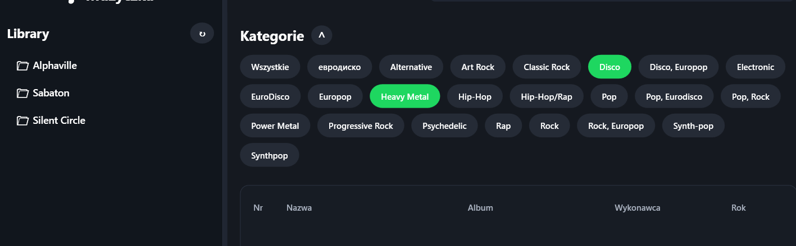

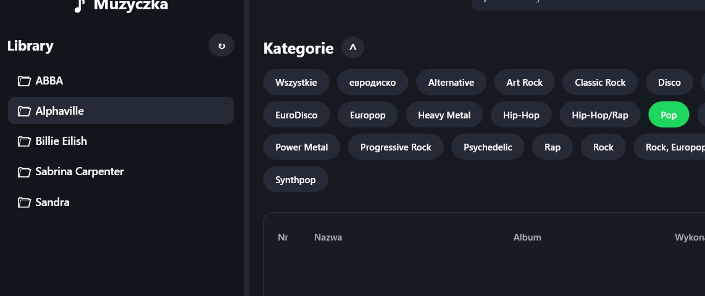

---

## 📋 Kolejka odtwarzania

Kolejka odtwarzania prezentuje utwory w formie tabeli z podziałem na foldery. Obsługuje sortowanie, wielokrotne zaznaczanie oraz usuwanie utworów.

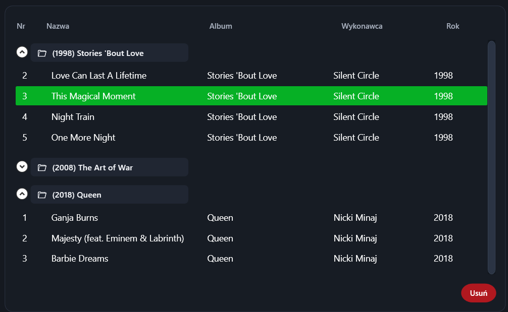

---

## ▶️ Odtwarzacz muzyczny

Panel odtwarzacza pokazuje aktualnie odtwarzany utwór, wykonawcę, okładkę albumu, pasek postępu oraz kontrolki odtwarzania i głośności.

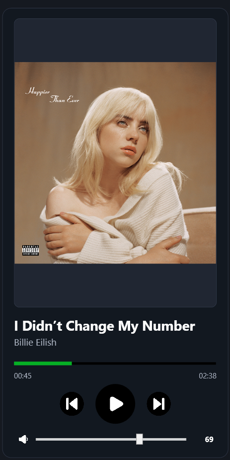


---

# 📝 Wymagania funkcjonalne

- Przeglądanie lokalnej biblioteki muzycznej.
- Wyświetlanie folderów i plików audio.
- Dodawanie pojedynczych utworów do kolejki.
- Dodawanie wielu utworów do kolejki.
- Dodawanie całych folderów do kolejki.
- Obsługa zaznaczania przez `Ctrl` i `Shift`.
- Grupowanie utworów według folderów.
- Sortowanie kolejki według kolumn.
- Usuwanie utworów z kolejki.
- Odtwarzanie plików audio.
- Pauzowanie i wznawianie odtwarzania.
- Przechodzenie do następnego i poprzedniego utworu.
- Regulacja głośności.
- Odczytywanie metadanych plików audio.
- Wyświetlanie okładki albumu.
- Filtrowanie biblioteki według gatunków.
- Wyszukiwanie plików i folderów.

---

# ⚙️ Wymagania niefunkcjonalne

- Przejrzysty i nowoczesny interfejs użytkownika.
- Responsywne skalowanie okna aplikacji.
- Intuicyjna obsługa metodą **przeciągnij i upuść**.
- Szybkie działanie przy większej liczbie plików.
- Czytelna prezentacja metadanych utworów.
- Stabilna obsługa lokalnych plików audio.
- Działanie bez konieczności połączenia z Internetem.

---

# 🛠 Technologie

- **C#**
- **WPF**
- **.NET**
- **XAML**
- **Windows Forms Integration**
- **Windows Media Player ActiveX**
- **TagLibSharp** — odczyt metadanych plików audio
- **Visual Studio**

---

# 📂 Struktura projektu

```text
Media/
│
├── images/                 # Ikony i grafiki aplikacji
├── Library/                # Folder z plikami muzycznymi
├── Properties/             # Zasoby projektu
│
├── App.xaml
├── App.xaml.cs
├── MainWindow.xaml         # Interfejs aplikacji
├── MainWindow.xaml.cs      # Logika aplikacji
├── Media.csproj
└── Media.sln
```

---

# 🚀 Uruchomienie projektu

## KROK 1: Pobranie projektu

Pobierz projekt z repozytorium GitHub lub sklonuj go za pomocą komendy:

```bash
git clone https://github.com/bebrabimba/Pzpp
```

## KROK 2: Otwarcie projektu

Otwórz plik:

```text
Media.sln
```

w programie **Visual Studio**.

## KROK 3: Przygotowanie biblioteki muzycznej

W głównym folderze projektu znajduje się folder:

```text
Library
```

Do tego folderu należy dodać pliki muzyczne, np.:

```text
.mp3, .m4a, .wav, .flac, .wma, .aac
```

## KROK 4: Uruchomienie aplikacji

W Visual Studio wybierz konfigurację:

```text
Debug / Any CPU
```

Następnie kliknij przycisk uruchamiania aplikacji.

---

# 🧪 Testowanie aplikacji

Aplikacja została sprawdzona pod kątem podstawowych scenariuszy użytkownika.

## ✅ Przykładowe testy funkcjonalne

- Uruchomienie aplikacji.
- Wczytanie plików z folderu `Library`.
- Wyświetlanie folderów w panelu biblioteki.
- Rozwijanie i zwijanie folderów.
- Zaznaczanie wielu plików przez `Ctrl`.
- Zaznaczanie zakresu plików przez `Shift`.
- Przeciąganie plików do kolejki.
- Przeciąganie folderów do kolejki.
- Odtwarzanie wybranego utworu.
- Pauzowanie utworu.
- Przejście do następnego utworu.
- Przejście do poprzedniego utworu.
- Regulacja głośności.
- Usuwanie utworów z kolejki.
- Filtrowanie biblioteki po gatunku.
- Wyszukiwanie plików w bibliotece.

## ⚠️ Scenariusze brzegowe

- Próba dodania tego samego pliku kilka razy.
- Próba odtworzenia pliku bez metadanych.
- Pliki bez okładki albumu.
- Puste foldery w bibliotece.
- Bardzo długie nazwy utworów.
- Bardzo duża liczba plików w bibliotece.
- Zmiana rozmiaru okna aplikacji.
- Usunięcie aktualnie odtwarzanego utworu z kolejki.

---

# 🔒 Dane użytkownika

Aplikacja działa lokalnie i korzysta z plików znajdujących się na komputerze użytkownika. Nie przesyła danych do Internetu i nie wymaga konta użytkownika.

---

# 📧 Kontakt

W razie pytań dotyczących projektu można skontaktować się z autorami aplikacji:

```text
tyky42212@gmail.com
```

---

# 🚀 Instrukcja instalacji aplikacji Muzyczka

Poniżej znajduje się instrukcja instalacji programu **Muzyczka** za pomocą instalatora:

```text
Muzyczka_Setup.msi
```

---

## Informacje podstawowe

| Nazwa | Wartość |
|---|---|
| Nazwa instalatora | `Muzyczka_Setup.msi` |
| Nazwa programu | `Muzyczka` |
| Główny plik programu | `Media.exe` |
| Przykładowy folder instalacji | `D:\Muzyczka\` |

---

## KROK 1: Uruchomienie instalatora

Aby rozpocząć instalację, należy uruchomić plik:

```text
Muzyczka_Setup.msi
```

Po uruchomieniu pojawi się kreator instalacji produktu **Muzyczka_Setup**. Na ekranie powitalnym należy kliknąć przycisk **Dalej**.

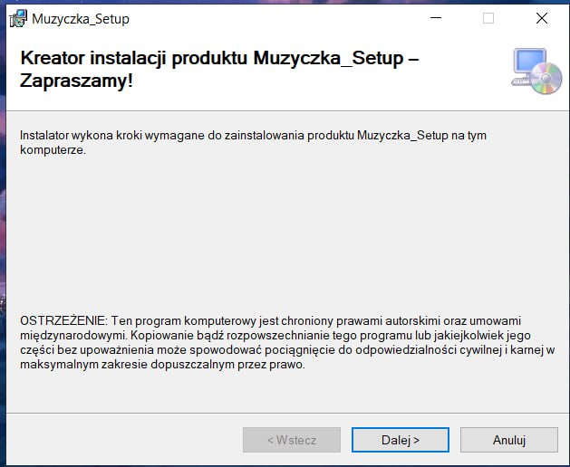

---

## KROK 2: Wybór folderu instalacji

W kolejnym oknie użytkownik wybiera folder, w którym zostanie zainstalowana aplikacja. Domyślnie można wskazać na przykład:

```text
D:\Muzyczka\
```

Jeżeli użytkownik chce wybrać inne miejsce instalacji, powinien kliknąć przycisk **Przeglądaj**. Można również sprawdzić wymagane miejsce na dysku, klikając **Koszt dysku**.

Następnie należy wybrać, czy program ma zostać zainstalowany dla wszystkich użytkowników komputera, czy tylko dla aktualnie zalogowanego użytkownika.

- **Wszyscy** — program będzie dostępny dla wszystkich użytkowników komputera.
- **Tylko ja** — program będzie dostępny tylko dla aktualnego użytkownika.

Po wybraniu ustawień należy kliknąć **Dalej**.

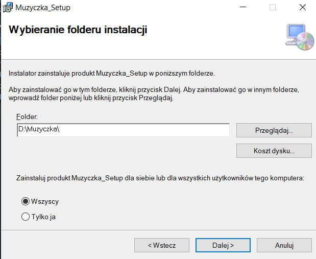

---

## KROK 3: Zakończenie instalacji

Po wykonaniu instalacji pojawi się komunikat informujący, że produkt **Muzyczka_Setup** został pomyślnie zainstalowany.

Aby zakończyć pracę instalatora, należy kliknąć przycisk **Zamknij**.

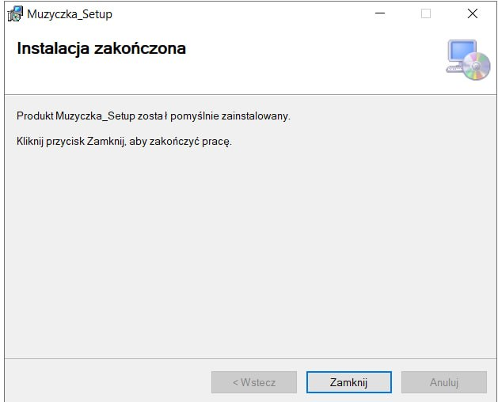

---

## 📂 Pliki po instalacji

Po poprawnej instalacji w wybranym folderze powinny znajdować się pliki aplikacji. Najważniejszym plikiem jest:

```text
Media.exe
```

To właśnie ten plik służy do uruchamiania programu **Muzyczka**.

Przykładowe pliki po instalacji:

```text
App.ico
AxInterop.WMPLib.dll
Interop.WMPLib.dll
Media.deps.json
Media.dll
Media.exe
Media.pdb
Media.runtimeconfig.json
Microsoft.DirectX.AudioVideoPlayback.dll
TagLibSharp.dll
```

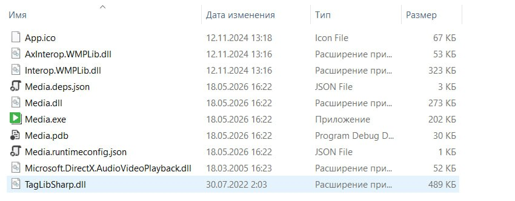

---

# 🔧 Naprawa lub usunięcie programu

Jeżeli program został już wcześniej zainstalowany i użytkownik ponownie uruchomi plik:

```text
Muzyczka_Setup.msi
```

instalator może wyświetlić okno z wyborem naprawy albo usunięcia programu.

## Naprawa programu

Opcja **Naprawa produktu Muzyczka_Setup** służy do ponownego zainstalowania brakujących lub uszkodzonych plików programu. Należy ją wybrać, jeśli aplikacja nie uruchamia się poprawnie albo brakuje któregoś z plików.

## Usuwanie programu

Opcja **Usuwanie produktu Muzyczka_Setup** służy do odinstalowania aplikacji z komputera. Po wybraniu tej opcji instalator usunie pliki programu z folderu instalacyjnego.

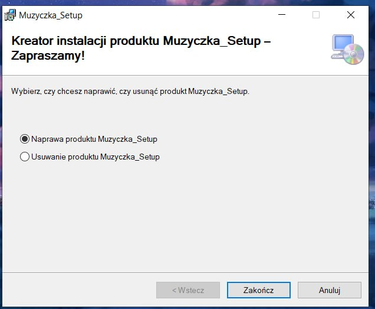

---

# 📝 Opis działania instalatora

Instalator `Muzyczka_Setup.msi` umożliwia szybkie zainstalowanie aplikacji desktopowej **Muzyczka** na komputerze użytkownika. Podczas instalacji użytkownik wybiera lokalizację programu oraz decyduje, czy aplikacja ma być dostępna dla wszystkich użytkowników komputera, czy tylko dla aktualnego konta.

Po zakończeniu instalacji aplikację można uruchomić za pomocą pliku:

```text
Media.exe
```

Program działa lokalnie i korzysta z plików muzycznych znajdujących się na komputerze użytkownika.
